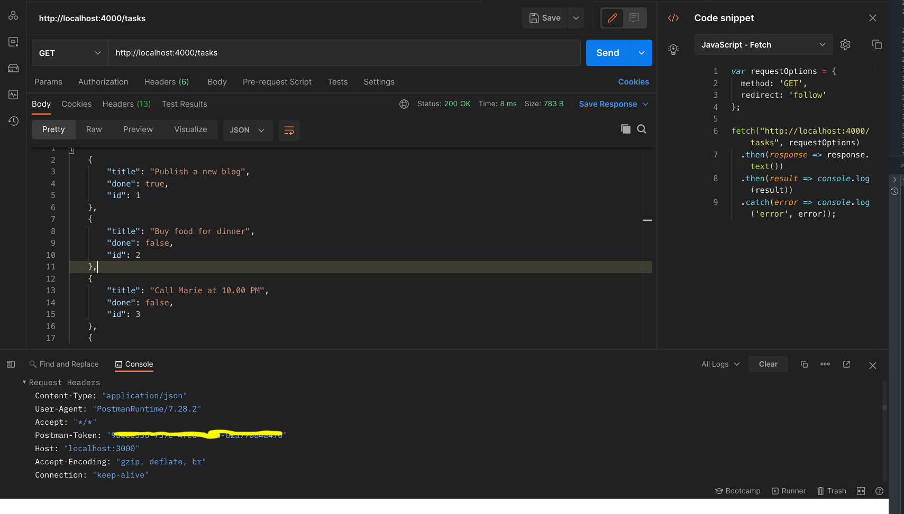

# Todo API
A simple JSON mock API for todo list React Application CRUD
<br />
<br />

<br />
<br />
## Instructions

Install dependencies

```bash
$ npm i
```

Start Server

```bash
$ npm start
```

Also when doing requests, its good to know that
- If you make POST, PUT, PATCH or DELETE requests, changes will be automatically and safely saved to `db.json` using [lowdb](https://github.com/typicode/lowdb).
- Your request body JSON should be object enclosed, just like the GET output. (for example ` {"title": "test", "completed": true,}`)
- Id values are not mutable. Any `id` value in the body of your PUT or PATCH request wil be ignored. Only a value set in a POST request wil be respected, but only if not already taken.
- A POST, PUT or PATCH request should include a `Content-Type: application/json` header to use the JSON in the request body. Otherwise it will result in a 200 OK but without changes being made to the data.
<br />
<br />


## Routes

Out of the box, we get a CRUD.<br/>
Based on the `db.json` file, here are all the default routes. 

```
GET    /tasks
GET    /tasks/1
PUT    /tasks/1
PATCH  /tasks/1
DELETE /tasks/1
```
<br />
<br />

## For Full Documentation on JSON Server Package:  
[https://www.npmjs.com/package/json-server](https://www.npmjs.com/package/json-server)
